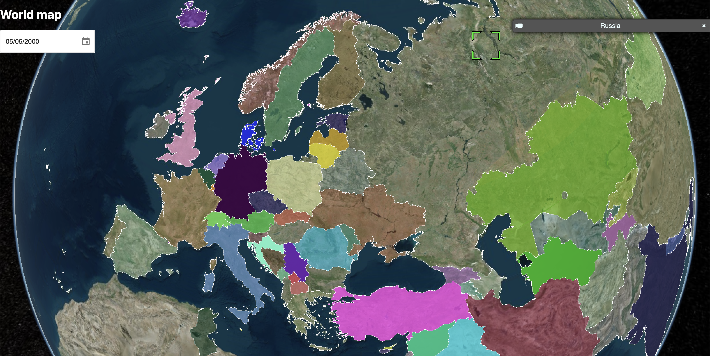

# Grenzeit frontend

This is a Next.js project (for now mostly a client-side generated one) that is intended to provide an interface for viewing data from the grenzeit website


## Getting Started

### Development server

```bash
npm run dev
```



Open [http://0.0.0.0:3000](http://0.0.0.0:3000) with your browser to see the result.